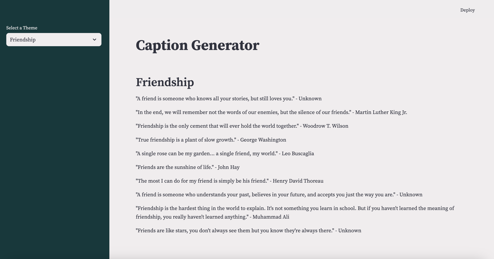

# caption-generator-ai
This project was to practically apply my knowledge of langchain, LLMs and my love for a good quote. It's not uncommon to find that quotes are used in Instagram posts, so this was the inspiration for the prompt.

When the application is run, it looks like this in the browser:



## How to run
1. Install virtualenv:
```
$ pip install virtualenv
```

2. Open a terminal in the project root directory and run:
```
$ virtualenv env
```

3. Then run the command to activate the virtual environment:
Windows
```
$ .\env\Scripts\activate
```

MacOS/Unix
```
$ source env/bin/activate
```

4. Install the dependencies:
```
$ (env) pip install -r requirements.txt
```

5. From the root of the project, run this command in the terminal:
```
$ (env) streamlit run application.py
```

6. This should open the app locally in a browswer window. If not, the web app will be available at: http://localhost:8502/